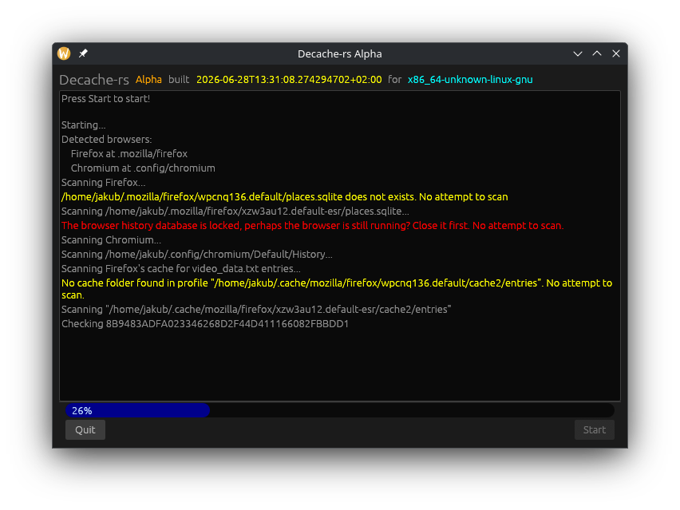

#  Decache-rs

A complete Rust rewrite of Decache by SindexMon https://github.com/SindexMon/decache/ (and all it's components) aimed to have GUI and work on Linux, Windows and Mac.
It is aimed to be fully compatibile with assets of the original Decache.

## Alpha release for Linux will be released soon!

<!--NOT READY YET
## Alpha version for Linux has been released!
1. Download precompiled decache-rs from releases.
2. Copy `data` directory from the original Decache
3. Put it in the same directory as decache-rs executable
4. Start the program

In alpha version Deache-rs will scan for entries from history_data.txt, video_data.txt and asset_data.txt in browsers' cache directories of your home directory (Supports Firefox, LibreWolf, Chrome and Chromium). It will display positive results (ex "Found XYZ!") as green messages in the log view. Progress of each entry is shown on a progressbar. No found lost media will be sent to SindexMon or anywhere in this version.

### You can build it from source too:
-->
Use `cargo build --release --target x86_64-unknown-linux-gnu` to build it for linux.

